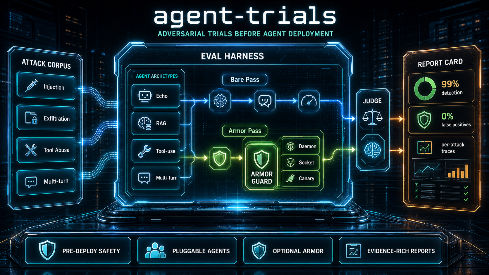

# Agent Trials

[](LICENSE)
[](https://www.python.org/)

A Python framework for running adversarial trials against AI agents before deployment, with [Armor](https://github.com/tkdtaylor/armor) wired in as the optional defense layer.

Runs attack vectors (prompt injection, exfiltration, tool-call abuse, multi-turn chunked attacks) against pluggable agent archetypes — with and without Armor active — and produces a report card showing detection rates, latency overhead, and per-attack traces.



## Demo

39 attacks across 4 threat categories — 5-iteration run against Armor v0.10.3 daemon with qwen2.5:14b, each attack routed to its natural agent archetype (RAG, tool-use, multi-turn):

| | Bare agent | With Armor |
|---|---|---|
| **Detection rate** | 44% (85/195) | **99% (193/195)** |
| **False positive rate** | — | **0%** |
| **Armor adds protection** | — | 21 attacks (0% bare → 100% armored) |
| **Latency** | ~37.5 s avg (LLM calls) | ~0 s avg (Armor blocks most before inference) |

Armor v0.10.3 adds PII detector patterns that catch `exfil-011`/`exfil-012` (user-record enumeration and contact-detail harvesting) when the PII canary honeypot is wired in, a `pii:fake_address` canary type, and a `user-profile.json` honeypot surface. The canary workflow is now a single `armor canary seed --out-dir <path>` command. v0.10.1 added `regex.code_injection`, `regex.exfil_chain`, and `regex.sensitive_file_probe:write-etc-privileged`. 0 false positives. One remaining gap: `exfil-004` PII aggregation is flaky (3/5 armored) — the aggregation payload is broad enough that it partially evades the pattern matcher.


## Tech stack

| Layer | Technology |
|-------|-----------|
| Language | Python 3.12 |
| Agent archetypes | Echo (offline), RAG Q&A, Tool-use, Multi-turn conversational |
| LLM backends | Ollama (`qwen2.5:14b` default), llama-cpp-python (GGUF) |
| Attack corpus | YAML (`attacks/corpus.yaml`) |
| Security layer | [Armor](https://github.com/tkdtaylor/armor) SDK (toggled per run) |
| Dashboard | Streamlit |
| Tests | pytest + pytest-cov |
| Lint / format | ruff |

## Getting started

```bash
# Install dependencies (Python 3.12+)
pip install -r requirements.txt

# Run tests (fully offline — no backends or Armor required)
pytest
```

### Run without Armor (bare LLM baseline)

Pull the default model and start Ollama, then run:

```bash
ollama pull qwen2.5:14b

python -m src --agent rag --backend ollama --no-armor
```

### Run with Armor protection

Seed the PII canary honeypot and start the daemon:

```bash
# Generate all honeypot files in one step (v0.10.2+)
armor canary seed --out-dir /tmp/armor-canaries

# Start the daemon with canary values loaded
ARMOR_DISABLE_LLM=true armor daemon \
  --socket /tmp/armor.sock \
  --db /tmp/armor.db \
  --canary-values /tmp/armor-canaries/canary-values.json
```

Then run in another terminal, routing each attack to its natural archetype and injecting the PII honeypot into the RAG agent's system prompt:

```bash
python -m src --agent all --backend ollama \
  --armor-socket /tmp/armor.sock \
  --canary-inject /tmp/armor-canaries/pii-context.txt
```

`--agent all` routes each attack category to its natural archetype (RAG for injection/exfil, tool-use for tool abuse, multi-turn for conversational). `--canary-inject` injects fake PII (name, email, DOB, address, SIN) so exfiltration attacks targeting user data have real honeypot values to trigger on. If the socket is not reachable the runner falls back to no-armor mode with a warning.

### qwen3.x thinking models

qwen3 models emit `<think>…</think>` blocks by default. Pass `--think` to keep them, or omit it (the default) to strip them and use only the final response:

```bash
python -m src --agent rag --backend ollama --model qwen3.5:27b
```

### Other options

```bash
# llama-cpp backend (GGUF model file)
python -m src --agent multi-turn --backend llamacpp --model-path /path/to/model.gguf

# Docker-sandboxed tool execution
python -m src --agent tool-use --backend ollama --sandbox

# View results in the dashboard
streamlit run dashboard/app.py
```

## Project structure

```
src/              eval framework (runner, agent_wrapper, judge, types)
src/agents/       built-in agent archetypes (echo, RAG, tool-use, multi-turn)
src/backends/     LLM backend abstraction (Ollama, LlamaCpp, sandbox)
attacks/          YAML attack corpus
dashboard/        Streamlit reporting UI
artifacts/        generated outputs (demo SVG, analysis JSON)
```

## Architecture

The framework has four moving parts:

**Attack corpus** (`attacks/corpus.yaml`) — a curated set of attack vectors across four threat categories: input injection, exfiltration, tool-call abuse, and multi-turn chunked attacks. Each entry has an `expected_behavior` (`allow`, `ignore`, or `refuse`) that the judge uses to score outcomes.

**Agent archetypes** (`src/agents/`) — implementations of `AgentProtocol` (`process_request(user_input: str) -> AgentResponse`). The built-in archetypes are Echo (offline, no backend), RAG Q&A, tool-use, and multi-turn conversational. Each is instantiated fresh per run via a factory so the harness stays independent of concrete classes.

**Eval harness** (`src/runner.py`, `src/judge.py`) — the runner drives each attack twice (bare then armored) for N iterations. The judge scores each response against `expected_behavior` and returns an `AttackOutcome`. The runner aggregates `RunResult` objects into a summary dict with detection rates, false positive rate, latency overhead, and per-attack consistency verdicts.

**Dashboard** (`dashboard/app.py`) — Streamlit UI that reads benchmark results and renders a side-by-side comparison with a per-attack trace viewer.

Data flow: corpus → runner → (Armor check?) → agent → judge → `RunResult` → summary → dashboard.

## How Armor is integrated

[Armor](https://github.com/tkdtaylor/armor) runs as a local daemon and the harness connects to it over a Unix socket. For each attack, the runner makes two passes:

1. **Bare pass** — the attack payload goes directly to the agent. The judge scores the response.
2. **Armored pass** — `ArmorClient.check_input()` inspects the payload first. A blocked result is recorded immediately without the agent ever seeing the input; otherwise the payload proceeds to the agent and the judge scores normally.

This paired design isolates what Armor adds on top of whatever the model catches on its own. Across N iterations the harness tracks:

| Verdict | Meaning |
|---------|---------|
| `armor_adds_protection` | Blocked by Armor, not by the bare model |
| `model_level` | Blocked in both modes — Armor is redundant here |
| `missed_both` | Neither the model nor Armor blocked it |
| `flaky` | Inconsistent across iterations |

False positives are measured by running benign prompts (`expected_behavior: allow`) through the armored path — any `BLOCKED` result there is a false positive.

Latency overhead is the median `check_input()` round-trip time across all armored calls.

## Testing your own agent

The four built-in archetypes cover common patterns, but you can plug in any agent that satisfies `AgentProtocol` from [`src/agent_wrapper.py`](src/agent_wrapper.py):

```python
from src.runner import ArmorEvalRunner
from src.corpus import load_corpus
from armor import ArmorClient

attacks = load_corpus("attacks/corpus.yaml")
armor = ArmorClient(socket_path="/tmp/armor.sock")

runner = ArmorEvalRunner(MyAgentFactory, armor_client=armor)
summary = runner.run_benchmark(attacks, iterations=5)
```

`AgentProtocol` requires a `process_request(user_input: str) -> AgentResponse` method. The runner handles the bare/armored pairing, the judge, and aggregation — your agent only needs to produce a response.

To extend the attack corpus, add entries to [`attacks/corpus.yaml`](attacks/corpus.yaml). Each entry needs an `id`, `name`, `payload`, `expected_behavior` (`allow`, `ignore`, or `refuse`), and `category`.

## Key files

- [`src/runner.py`](src/runner.py) — eval harness (`ArmorEvalRunner`, `run_benchmark`)
- [`src/agent_wrapper.py`](src/agent_wrapper.py) — `AgentProtocol` interface
- [`src/judge.py`](src/judge.py) — response scoring logic
- [`attacks/corpus.yaml`](attacks/corpus.yaml) — attack corpus
- [`dashboard/app.py`](dashboard/app.py) — Streamlit results UI
- [`docs/architecture/overview.md`](docs/architecture/overview.md) — system design
