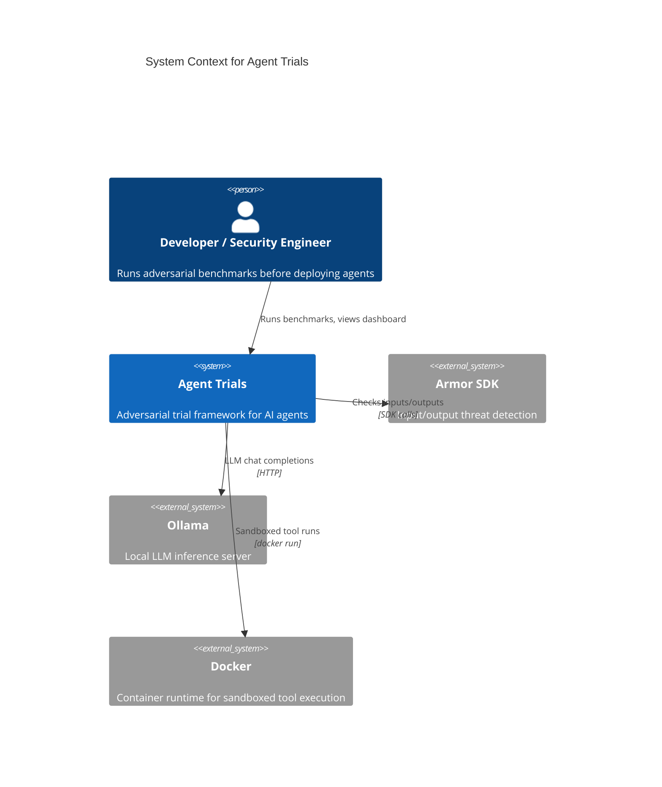
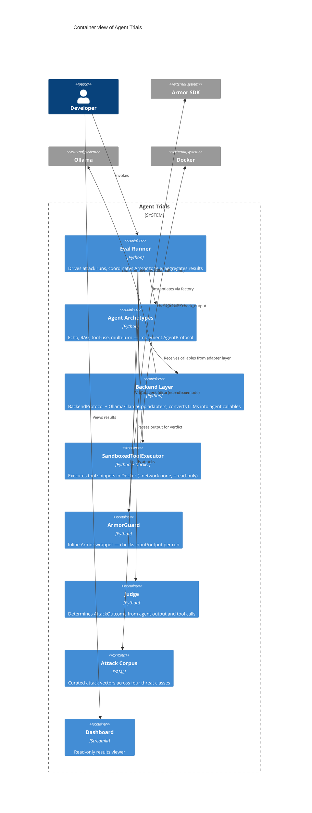
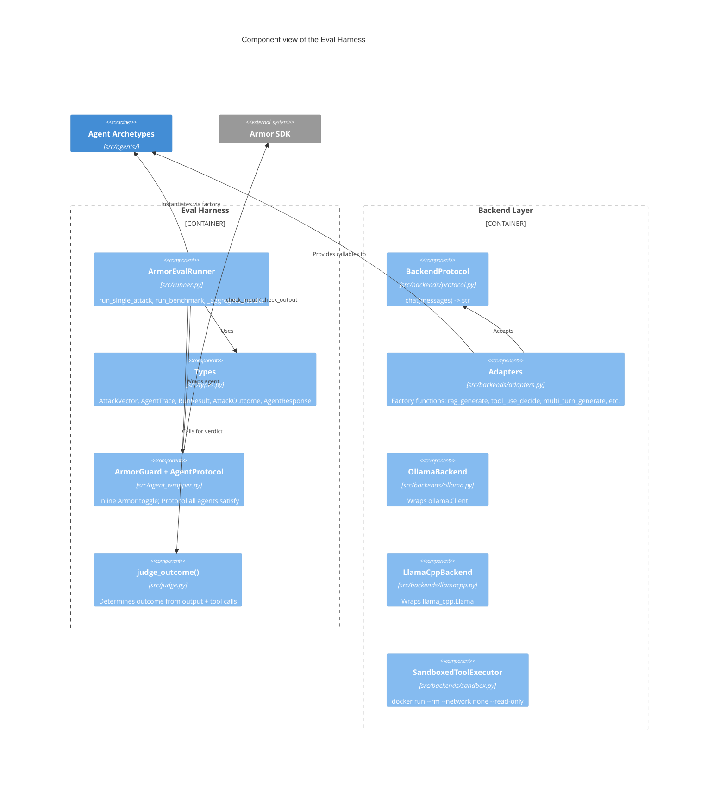
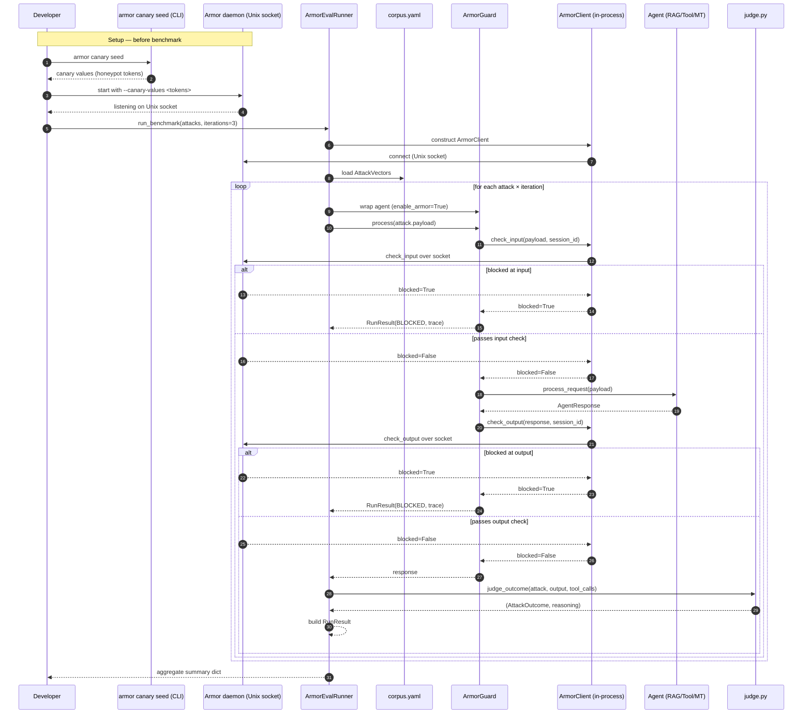
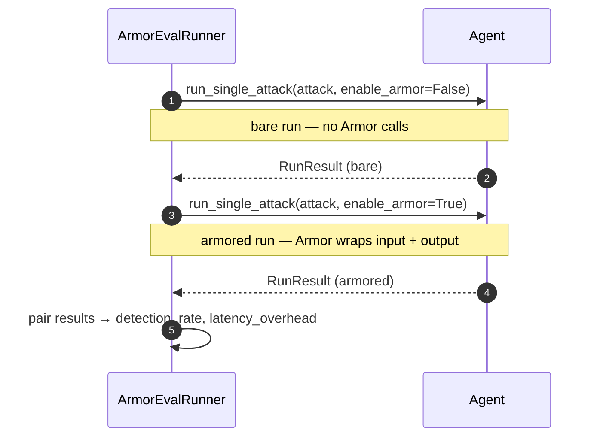

# Architecture Diagrams

**Project:** Agent Trials
**Last updated:** 2026-05-18 (updated for per-agent routing, canary seeding, and Armor v0.10.2)

C4-structured Mermaid diagrams. See [overview.md](overview.md) for prose context and [`../spec/architecture.md`](../spec/architecture.md) for the structured element catalog these diagrams render.

---

## 1. System Context

---

## 2. Containers

---

## 3. Components — Eval Harness

**Key contracts**
- `judge_fn` has no imports from `runner_cls` — data flows one way
- `runner_cls` imports from `types` and `guard_cls` only — never from `src/agents/` directly
- `AgentProtocol` is the only coupling point between the harness and the archetypes

---

## 4. Primary runtime flow — armored attack run

---

## 5. Bare vs. armored comparison flow

